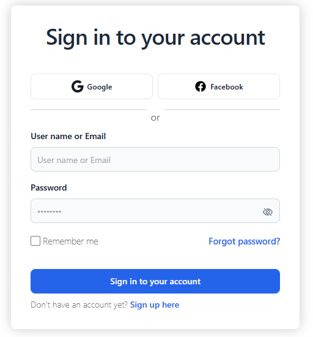
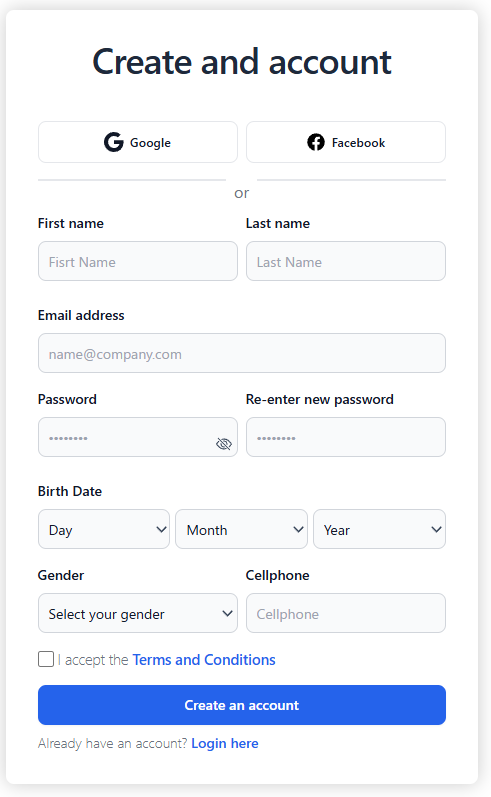

### Social Login and Advanced Security Authentication Plugin

A robust solution for user authentication that combines the convenience of social login with enhanced security features, including reCAPTCHA and two-factor authentication (OTP). This plugin allows you to provide a secure and seamless login experience for your users, offering the choice between social logins (Facebook and Google) or traditional account registration.

### Features
Enhance Security
Protect your site against brute force attacks, bots, and other threats with the integration of reCAPTCHA and OTP authentication. reCAPTCHA serves as a barrier against automated access, while OTP ensures that only the authorized user can access their account.

